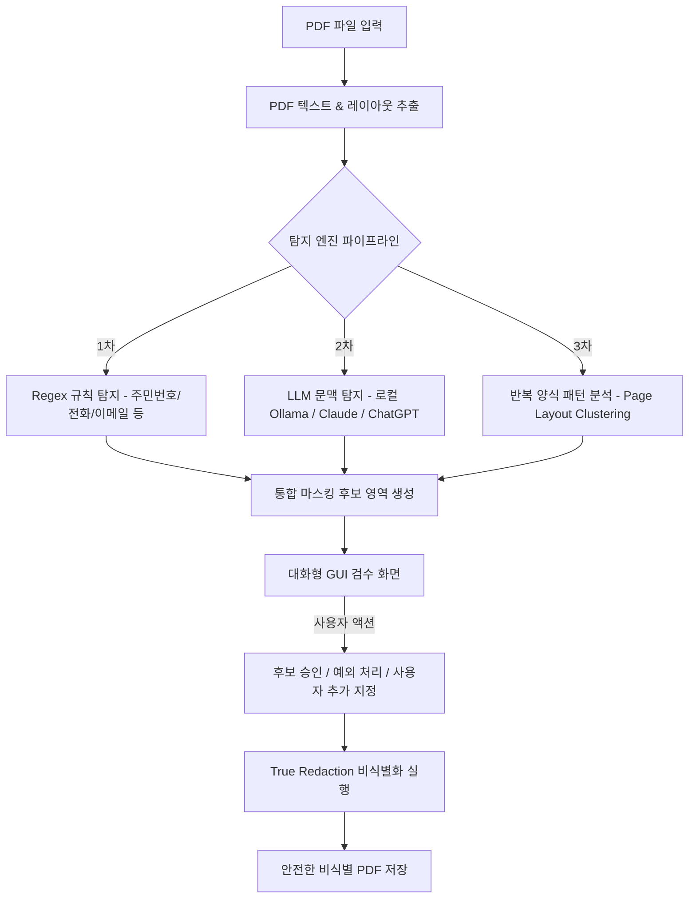

# [PRD] AI 기반 크로스플랫폼 PDF 개인정보 탐지 및 비식별화(Redaction) GUI 프로그램

> **문서 버전:** v1.0  
> **작성일:** 2026-07-28  
> **상태:** 완료 (Implemented)  

---

## 1. 개요 및 목적 (Overview & Goals)

본 제품은 PDF 문서 내 포함된 주민등록번호, 전화번호, 주소, 계좌번호, 성명 등 **개인식별정보(PII)**를 자동으로 탐지하고, 사용자가 검수 및 수정을 거쳐 **완벽하게 영구 비식별화(내용 삭제 및 검은색 마스킹 박스 처리)**할 수 있는 크로스플랫폼 GUI 애플리케이션입니다.

### 핵심 해결 과제
1. **개인정보 유출 방지 및 프라이버시**: 클라우드 송신 없이 **Ollama 등의 로컬 LLM**을 우선 활용할 수 있는 환경 제공 (필요시 Claude, OpenAI 등 외부 API 선택 가능).
2. **반복 양식 PDF의 효율적 처리**: 수십~수백 페이지 분량의 동일/반복 서식 문서에서 패턴을 자동 분석하여 단 일회의 검수로 전체 페이지에 일괄 마스킹 적용.
3. **오탐 및 과탐 제어 (예외 처리)**: 규칙 및 AI 분석 결과를 사용자가 시각적으로 확인하고, 특정 텍스트/영역을 무시(Ignore)하거나 직접 지정 마스킹할 수 있는 유연한 검수 인터페이스 제공.
4. **진정한 비식별화 (True Redaction)**: 단순히 텍스트 위에 검은 박스를 그리는 시각적 처리가 아니라, **PDF 내부 벡터/메타데이터/텍스트 스트림 자체를 완전히 렌더링 제거**하는 실제 보안 비식별화 수행.

---

## 2. 타겟 사용자 및 유즈케이스 (Target Users & Use Cases)

| 사용자 유형 | 주요 유즈케이스 | 핵심 니즈 |
| :--- | :--- | :--- |
| **기업/기관 개인정보 관리자** | 고객 서류, 계약서, 신청서 등의 외부 공개 전 마스킹 | 외부 유출 없는 로컬 처리, 대량 문서 처리 속도 |
| **법률/공공 분야 연구자** | 판결문, 공공 문서, 민원 서류 비식별화 | 성명, 사건번호, 주소 등의 정밀 탐지 및 예외 처리 |
| **일반 사용자/프리랜서** | 개인 영수증, 통장 사본, 신분증 PDF 마스킹 | 복잡한 설정 없는 간편한 GUI 및 즉각적인 마스킹 결과 확인 |

---

## 3. 주요 기능 요구사항 (Functional Requirements)

### 3.1. 멀티 LLM & AI 연동 파이프라인
- **로컬 LLM 지원**: Ollama (Llama 3, Qwen 2.5, DeepSeek R1 등) REST API 연동. 네트워크 연결 없이 100% 온디바이스 탐지 가능.
- **외부 Cloud API 지원**: OpenAI (ChatGPT GPT-4o 등), Anthropic (Claude 3.5 Sonnet 등) API Key 등록 및 선택 기능.
- **하이브리드 탐지 (Hybrid Detection Engine)**:
  - **1차 (Regex/Rule)**: 주민등록번호, 외국인등록번호, 전화번호, 이메일, 계좌번호, 사업자등록번호, 운전면허번호 등 정규식 기반 초고속 1차 필터링.
  - **2차 (LLM Context Analysis)**: 정규식으로 잡기 힘든 성명, 직책, 소속, 문맥상 개인정보, 주소 등을 LLM을 통해 정밀 식별.

### 3.2. 반복 양식 패턴 분석 및 일괄 마스킹 (Batch Pattern Analysis)
- **페이지 레이아웃 구조 분석**:
  - 문서 내 반복되는 페이지 패턴(예: 3페이지마다 반복되는 동일 양식, 특정 양식 서식 위치)을 자동 감지.
  - 템플릿 기반 또는 좌표 기준 Bounding Box 패턴 자동 클러스터링.
- **대표 페이지 샘플 검수 & 전체 적용 (Pattern Master Control)**:
  - 분석된 대표 패턴 페이지에서 마스킹 영역을 사용자가 확인/수정하면, 해당 서식 구조를 가진 전체 페이지에 일괄 적용.
  - 적용 전 "동일 양식 전체 반영" 미리보기 및 승인 모달 제공.

### 3.3. 대화형 검수 UI 및 예외 처리 (Interactive Review & Exception Rules)
- **시각적 PDF 뷰어**:
  - PDF 렌더링 미리보기, 확대/축소, 페이지 이동.
  - 마스킹 후보 영역에 색상 구분 오버레이 (예: Red: 필수 개인정보, Yellow: LLM 추정, Blue: 양식 패턴).
- **예외 처리 (Ignore/Exclude) 기능**:
  - 특정 텍스트 무시 ("이 단어는 회사명이므로 전체 무시", "이 영역은 마스킹 대상 아님").
  - 단일 항목 무시, 동일 단어 전체 무시, 지정 유형 전체 무시 선택 가능.
- **사용자 수동 지정 (Custom Redaction)**:
  - 마우스 드래그로 원하는 영역(Bounding Box) 직접 선택 및 마스킹 추가.
  - 마스킹 형태 선택: **내용 삭제 + 검은 박스** 또는 **내용 완전 삭제 + 빈 공간(백색)** 처리.

### 3.4. 완벽한 PDF 비식별화 (True Redaction Engine)
- **단순 덮어쓰기 금지 (Critical)**: PDF 위에 단순히 검은 사각형 쉐이프를 그리는 방식은 텍스트 복사가 가능하므로 절대 금지.
- **텍스트/이미지 스트림 제거**: 해당 좌표 영역 내부의 Text Font Character, Vector Graphic, 이미지 픽셀 데이터를 PDF 객체 레벨에서 삭제 및 재구성.
- **메타데이터 정화**: 작성자, 생성 프로그램, 수정 이력 등 PDF 메타데이터 제거 옵션 제공.

---

## 4. 비기능 요구사항 (Non-Functional Requirements)

- **보안 및 프라이버시**: 외부 API 사용 시에도 사용자 승인 없이는 어떠한 데이터도 외부 서버로 전송되지 않음. 기본 설정값으로 로컬 Ollama 또는 Regex 탐지 모드 사용.
- **크로스플랫폼**: Windows 10/11, macOS, Linux 지원.
- **성능**: 대용량 PDF 비동기 분석 및 실시간 Canvas 렌더링.
