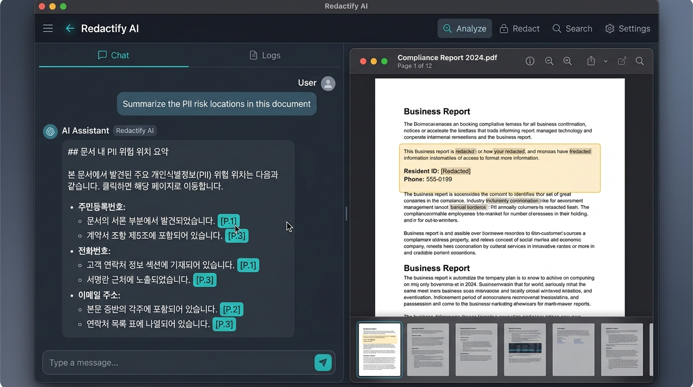
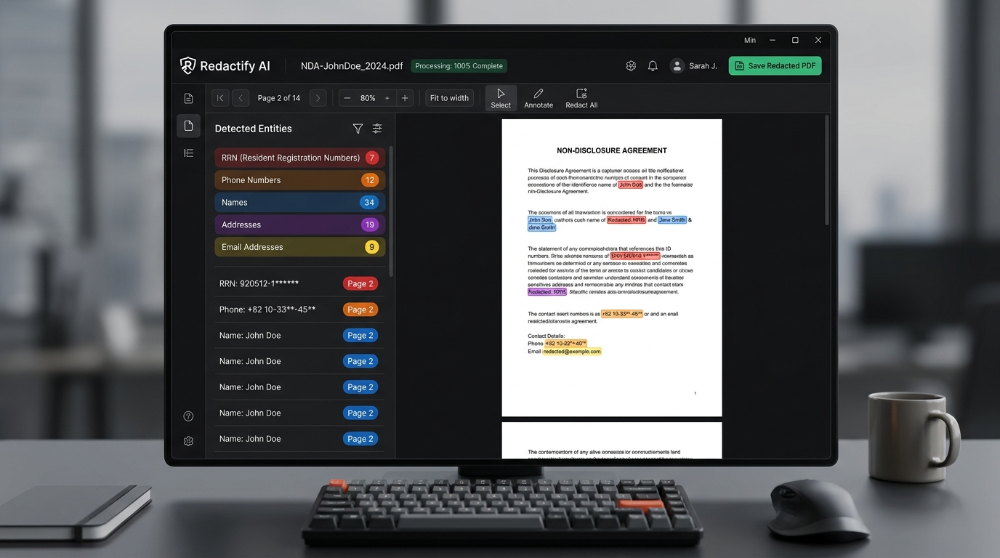
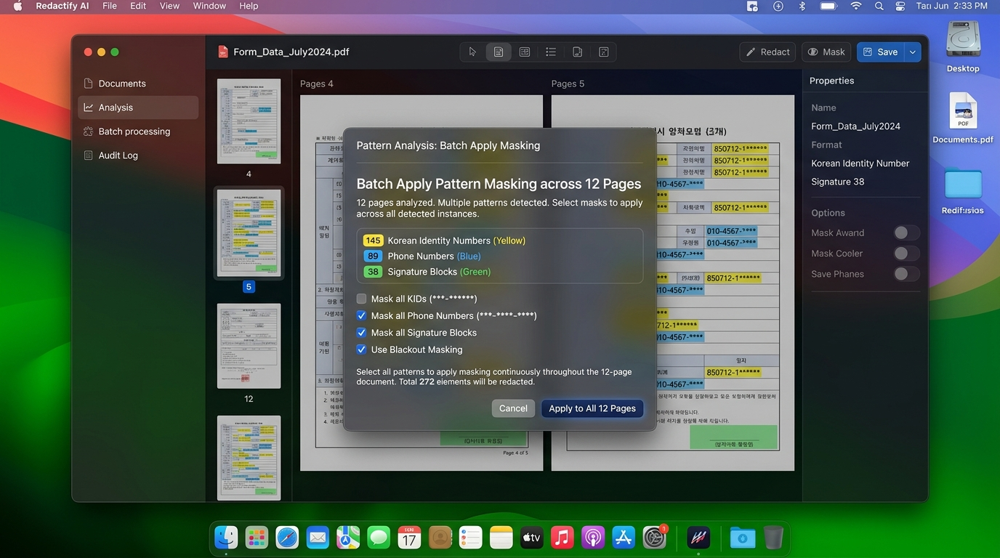
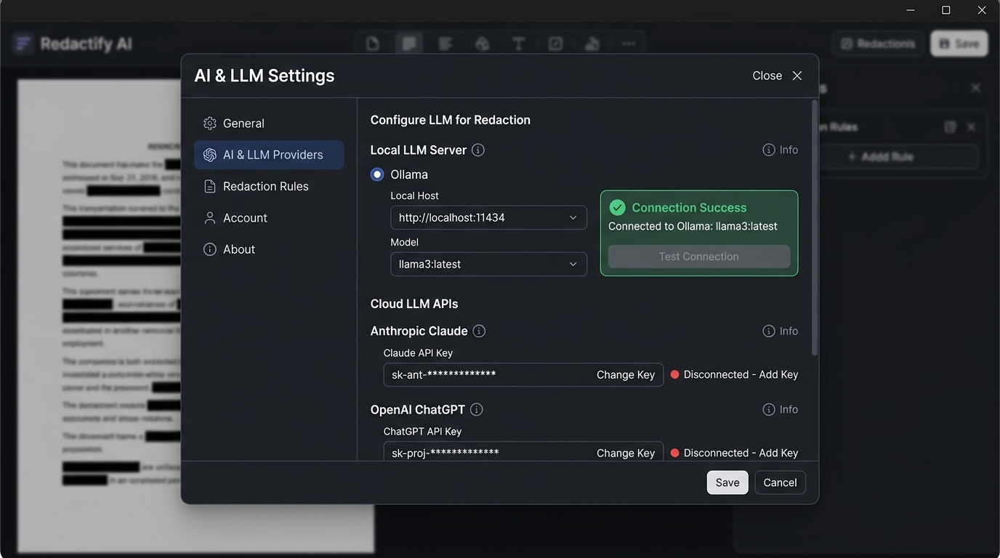

# 🖥️ Redactify AI - Desktop PDF PII Redactor & RAG Q&A

> **크로스플랫폼(Windows, macOS, Linux) AI 기반 PDF 개인정보 탐지, RAG 문서 질의응답 및 반복 양식 일괄 비식별화(Redaction) Desktop GUI 애플리케이션**


---

## 📸 데스크톱 애플리케이션 스크린샷 (Screenshots & Feature Demo)

### 1. 🤖 RAG 기반 AI 문서 질의응답 (RAG Document Q&A Assistant)
> PDF 업로드 시 문서 텍스트를 RAG 벡터 DB로 자동 색인하여 "문서 핵심 요약", "개인정보 유출 위험 위치", "성명/계좌 정보" 등을 AI가 실시간 답변하고 관련 페이지 칩(`[P.1]`, `[P.3]`)으로 바로 이동합니다.



---

### 2. 🖥️ 메인 데스크톱 GUI 검수 화면 (Main Desktop GUI Interface)
> PDF 문서를 렌더링하고 사이드바 패널에서 정규식 & AI 기반 개인정보(주민번호, 전화번호, 이름, 주소 등) 탐지 결과를 시각적으로 검수합니다.



---

### 3. ⚡ 반복 서식 양식 패턴 일괄 마스킹 (Pattern Batch Redaction Test)
> 수십~수백 페이지의 반복 서식을 자동 분석하여 대표 페이지 마스킹 박스를 동일 서식 전체 페이지에 1-Click 일괄 적용합니다.



---

### 4. 🦙 로컬 LLM (Ollama) & Cloud AI 설정 (AI Settings Modal)
> 외부 송신 없는 100% 온디바이스 로컬 Ollama (`llama3`, `qwen2.5` 등) 연결 또는 Anthropic Claude, OpenAI ChatGPT API Key 설정 모달입니다.



---

## 📌 주요 핵심 기능 (Key Features)

### 1. 🤖 RAG (Retrieval-Augmented Generation) 문서 학습 & Q&A
- 업로드된 PDF 문서 텍스트를 RAG 벡터/문맥 DB로 자동 색인.
- 문서 내용, 민감정보 위험도, 성명/주소 위치에 대해 자연어로 질문하면 AI가 학습된 문서 DB를 탐색해 **참고 페이지 인용(`[P.1]`, `[P.3]`)과 함께 정밀한 답변** 구성.

### 2. 🛡️ 완벽한 보안 비식별화 (True Redaction Engine)
- `pdf-lib` 객체 렌더링 삭제 파이프라인을 통해 **PDF 내부 텍스트/이미지 스트림 및 메타데이터(작성자, 제목)를 완벽하게 영구 삭제**하여 드래그/복사/추출을 근본적으로 차단.

### 3. 🦙 프라이버시 최우선 로컬 LLM & Cloud API 연동
- **Ollama (로컬 LLM)**: 외부 네트워크 송신 없는 **100% 온디바이스(로컬)** 개인정보 분석 및 RAG Q&A.
- **Cloud AI (선택)**: Anthropic Claude (Claude 3.5 Sonnet), OpenAI ChatGPT (GPT-4o-mini) 연동 지원.
- **⚡ 정규식 전용 탐지**: 주민등록번호, 외국인번호, 전화번호, 이메일, 계좌번호, 여권번호, 사업자등록번호, 운전면허번호 고속 1차 필터링.

### 4. 📑 반복 양식 서식 패턴 분석 (Batch Layout Clustering)
- 수십~수백 페이지의 반복 서식(계약서, 신청서 등)을 자동 감지하여 대표 페이지 마스킹을 **[양식 전체 반영]** 버튼 클릭 한 번으로 모든 동일 양식 페이지에 일괄 적용.

---

## 🚀 실행 및 패키징 (Run & Build)

### 1. 단독 데스크톱 GUI 앱 실행 (Desktop GUI)

```bash
npm start
# 또는
npx electron .
```

### 2. 실행 파일 배포 패키징 (.exe, .dmg, .AppImage)

```bash
npm run dist
```

---

## 📜 라이선스 (License)

This project is licensed under the MIT License - see the [LICENSE](LICENSE) file for details.
